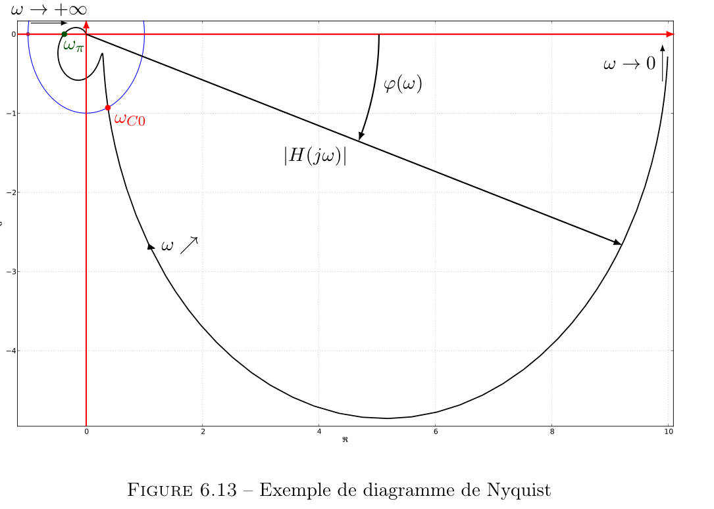

# Automatique
_This note is mainly in French._
> Principal References are textbooks from ECPK while small changes are made according to classes taught at ECM.  
> _These should be just the differences between different notations_

- [Automatique](#automatique)
  - [I. Base de connaissances](#i-base-de-connaissances)
    - [I.1 quelques notations utiles](#i1-quelques-notations-utiles)
    - [I.2 Transformée de Laplace](#i2-transformée-de-laplace)
    - [I.3 Système du $`1^{er}`$ ordre et $`2^{e}`$ ordre](#i3-système-du-1er-ordre-et-2e-ordre)
    - [I.4 Diagrammes fréquentiels](#i4-diagrammes-fréquentiels)
  - [II Méthodes de détermination des performances du système](#ii-méthodes-de-détermination-des-performances-du-système)
    - [II.1 Stabilité](#ii1-stabilité)
    - [II.2 Précision](#ii2-précision)
    - [II.3 Robustesse](#ii3-robustesse)
    - [II.4 Amortissement](#ii4-amortissement)
  - [III Déterminer les performances d'un système bouclé à partir de la boucle ouverte](#iii-déterminer-les-performances-dun-système-bouclé-à-partir-de-la-boucle-ouverte)
    - [III.1 Critère de Nyquist](#iii1-critère-de-nyquist)
    - [III.2 Critère de Revers](#iii2-critère-de-revers)
    - [III.3 Marges de stabilité](#iii3-marges-de-stabilité)
  - [IV Synthèse de Correcteur](#iv-synthèse-de-correcteur)

## I. Base de connaissances
### I.1 quelques notations utiles
 En régime permanent:
 **Stabilité,Précision, Robuste**
 >_Les deux dernières notations ne sont pas requis pour le semestre S7_

En régime transitoire:
**Temps de réponse à 5%** : $`\forall t>t_{5\%},\frac{| s(t)-s_{\infty} |}{s_{\infty}}<0.05`$   
**Gain statique**  
**Valeur de résonnance**  
**Bande Passante** ：des fréquences où  la valeur en cette fréquence vaut la valeur maximale $`-3dB`$

### I.2 Transformée de Laplace  
$`F(p)=\mathcal{L}[f(t)]=\int_{0^-}^{+\infty}{f(t)e^{-pt}dt}`$  
fonction de transfert: $`H(p)=\frac{K}{p^{\alpha}}\frac{N(p)}{D(p)}`$ $`\frac{Zéros}{Pôles}`$  
propriétés importantes:   
- Valeur initiale : $`f(0^+)=\lim_{p\rightarrow+\infty}{pF(p)}`$
- Valeur Finale : $`\lim_{t\rightarrow+\infty}{f(t)}=\lim_{p\rightarrow 0}{pF(p)}`$  
  
  
Voici les transformées de Laplace usuelles:  

__Formule de Black__:
Pour un système à boucle fermé:  

La fonction de transfert: $`H(p)=\frac{X(p)}{X_C(P)}=\frac{F_1(P)}{1+F_1(P)F_2(P)}`$  
_Ici, le + dans la fonction de transfert correspond au - dans le schéma._

### I.3 Système du $`1^{er}`$ ordre et $`2^{e}`$ ordre
- Système du $`1^{er}`$ ordre:  
  $` H(p)=\frac{S(p)}{E(p)}=\frac{K}{1+\tau p} `$  
  K est le gain statique; $`\tau`$ est la constante de temps
- Système du $`2^{e}`$ ordre:  
  $`H(p)=\frac{S(p)}{E(p)}=\frac{K}{1+2\xi\frac{p}{\omega_0}+\frac{p^2}{\omega_0^2}}`$  
  K est le gain statique; $`\omega_0`$ est la pulsation propre;  
  $`\xi`$ est le facteur d'amortissement; $`Q=\frac{1}{2\xi}`$ est le facteur de qualité.    

  __les notations importantes__  
  

  ### I.4 Diagrammes fréquentiels
  - Diagramme de Bode 
      $`G_{dB}(\omega)=20\log A(\omega)`$ et $`\varphi(\omega)`$    
       
      __Pulsation de coupure__$`\omega_{c0}`$ et __Pulsation d'opposition de phase__$`\omega_{\pi}`$

  - Diagramme de Black 
      $`G_{dB}(\omega)`$ en fonction de $`\varphi(\omega)`$    
      ](https://github.com/adamadong/Notes/blob/main/automatique/Black.jpg)
  - Diagramme de Nyquist
      $`Re[H(j\omega)]`$ en fonction de $`Im[H(j\omega)]`$    
       ](https://github.com/adamadong/Notes/blob/main/automatique/Nyquist.jpg)  
    __Pulsation de cassure/coupure à -3dB__  
    Pour un système du premier ordre : $`\omega_c=\frac{1}{\tau}`$    
     ](https://github.com/adamadong/Notes/blob/main/automatique/Bode1.jpg)  
    _Pulsation de résonance_  
    Pour un système d'ordre 2 tel que $`0\leq\xi<\frac{\sqrt{2}}{2}`$ : $`\omega_r=\omega_0\sqrt{1-2\xi^2}`$  
    __Tracer les diagrammes__  
    $`H(p)=\frac{K}{p^{\alpha}}e^{-\tau p}\prod(1+\tau_ip)^{\alpha_i}\prod(1+2\xi\frac{p}{\omega_0}+\frac{p^2}{\omega_0^2})^{\beta_i}`$  
    Bode asymptotique:  
    D'abord  
     ](https://github.com/adamadong/Notes/blob/main/automatique/step1.jpg) 
    Puis  
     ](https://github.com/adamadong/Notes/blob/main/automatique/step2.jpg) 
    <strong style="color:red">ATTENTION!</strong>  
    A ECM, l'asymptote pour la phase est tracé <strong style="color:red">différemment</strong>:  
    soit $`\omega_i`$ la pulsation propre d'un composant:  
    $`\varphi(\omega_i)=\varphi(\frac{\omega_i}{10})+\alpha_i\frac{\pi}{4}=\varphi(10\omega_i)-\alpha_i\frac{\pi}{4}`$  
    Il s'agit d'une ligne diagonale et non d'une ligne droite.

## II Méthodes de détermination des performances du système

  ### II.1 Stabilité
  __Condition nécessaire et suffisante de stabilité__  
  Un système est stable si et seulement si <strong style="color:red">tous les pôles</strong> de sa fonction de transfert sont à <strong style="color:red">partie réelle strictement négative</strong>.  
  __Table de Routh__
    
  Un système est stable si et seulement si les deux conditions ci-après sont vérifiées :  
  tous les coefficients de son équation caractéristique sont <strong style="color:red">de même signe</strong>;  
  tous les termes de <strong style="color:red">la première colonne</strong>, dite colonne des pivots, de la table de Routh de son équation caractéristique sont <strong style="color:red">de même signe</strong>   
  _tout changement de signe dans cette colonne correspond à l’existence d’un pôle à partie réelle positive._  
  ### II.2 Précision  
  Pour avoir une erreur nulle à une consigne:  
  -  en échelon, il faut au moins une intégration dans la boucle ouverte,
  -  en rampe, il faut au moins deux intégrations dans la boucle ouverte,
  -  en parabole, il faut au moins trois intégrations dans la boucle ouverte.  
  
    
  Notation ECM:
  - erreur en régime permanent -> échelon
  - erreur de position -> rampe
  - erreur de traînage -> parabole
  ### II.3 Robustesse
  Pour avoir une erreur nulle à une perturbation :  
  - en échelon, il faut au moins une intégration en amont de la perturbation,
  - en rampe, il faut au moins deux intégrations en amont de la perturbation,
  - en parabole, il faut au moins trois intégrations en amont de la perturbation.  
  ### II.4 Amortissement  
  ](https://github.com/adamadong/Notes/blob/main/automatique/coneamo.jpg)    
  $`\sin(\theta)=\frac{\xi\omega_0}{\omega_0}=\xi\\\leftrightarrow\theta=\arcsin(\xi)`$  
## III Déterminer les performances d'un système bouclé à partir de la boucle ouverte
  ### III.1 Critère de Nyquist  
  Contour de Bromwich $`\gamma`$  
   ](https://github.com/adamadong/Notes/blob/main/automatique/Bromwich.jpg) 
  
  $`Z_{\gamma}(1+H_{BO}(p))-P_{\gamma}(H_{BO}(p))=n^{hor}_{(-1,0)}(\Gamma_0)`$  
  $`Z_{\gamma}(1+H_{BO}(p))`$ : nombre de zéros de $`1+H_{BO}(p)`$, càd nombre de pôles en boucle fermé  
  $`P_{\gamma}(H_{BO}(p))`$ : nombre de pôles en boucle ouvert  
  $`\Gamma_0`$ est le lieu de Nyquist de $`H_{BO}(p)`$  
  $`n^{hor}_{(-1,0)}(\Gamma_0) `$ : le nombre de tours dans le sens horaire autour du point (-1,0)  
  __Critère de Nyquist__  
  Un système bouclé est stable si et seulement si le lieu de Nyquist de sa FTBO, décrit dans le sens des pulsations croissantes, ne passe pas par le point critique (-1, 0) et fait autour de celui-ci un nombre de tours, dans le sens trigonométrique, égal au nombre de pôles instables de sa FTBO.  
  En effet,  
  ](https://github.com/adamadong/Notes/blob/main/automatique/Preuve.jpg)  
  ### III.2 Critère de Revers  
  Un système bouclé est stable si sa fonction de transfert en boucle ouvert vérifie les deux conditions suivantes:  
  1. $`G_{dB-BO}(\omega_{\pi})< 0 dB`$ pour une pulsation $`\omega_{\pi}`$ telle que $`\varphi_{BO}(\omega_{\pi})=-\pi`$
  2. $`\varphi_{BO}(\omega_{C0})>-\pi`$ pour une pulsation $`\omega_{C0}`$ telle que $`G_{dB-BO}(\omega_{C0})=0`$
  
  Dans le plan de Bode:  
    
  Dans le plan de Black:  
    
  __Critère du revers dans le plan de Black__  
  Le système est stable en BF si, en parcourant le lieu fréquentiel de la BO dans le sens des pulsations croissantes, on laisse le point critique « à droite »  
  
  Dans le plan de Nyquist:  
    
  __Critère du revers dans le plan de Nyquist__  
  Le système est stable en BF si, en parcourant le lieu fréquentiel de la BO dans le sens des pulsations croissantes, on laisse le point critique « à gauche »  
    
  ### III.3 Marges de stabilité
  Marge de gain: $`MG=-G_{dB-BO}(\omega_{\pi})`$
  Marge de phase: $`M_\varphi=\pi+\varphi_{BO}(\omega_{C0})`$
  Un système est stable en boucle fermée si ses marges de stabilité vérifient $`MG>0\text{ et }M_\varphi>0`$  

## IV Synthèse de Correcteur  
  

